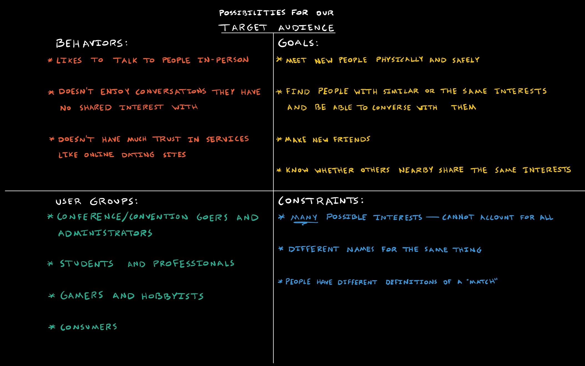

# Designing Friend Finder: An Interest Matching App With a Wearable Interface - A UX Case Study

## Problem
There is no way to know if you share an interest with someone unless you talk to them. When people do talk to each other, there is no guarantee that they share interests, making for inefficient social exchanges with undesirable outcomes. It is difficult to find people who are open to talking with you as well as who you have a common interest with. 

## Goals
Our goal is to design a project that will help connect nearby people with shared interests. 

## User Persona

### User Groups

### Behavior

### User Goals

### Constraints

## Solution Space

## Information Architecture

## User Flow

## Edge Cases

## Prototype

## Thanks for reading.
Feedback is much appreciated.
